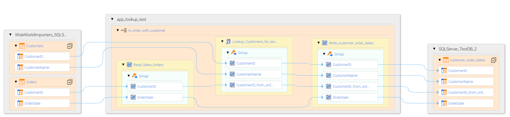
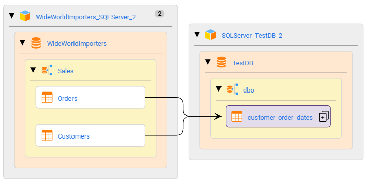
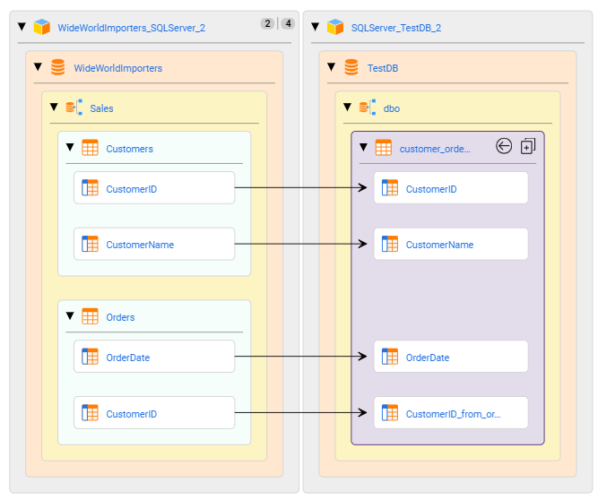
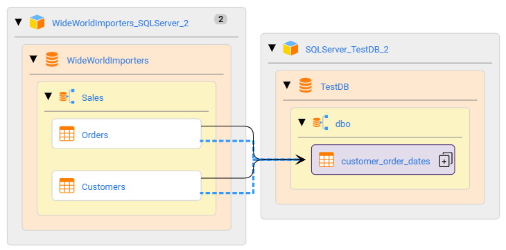
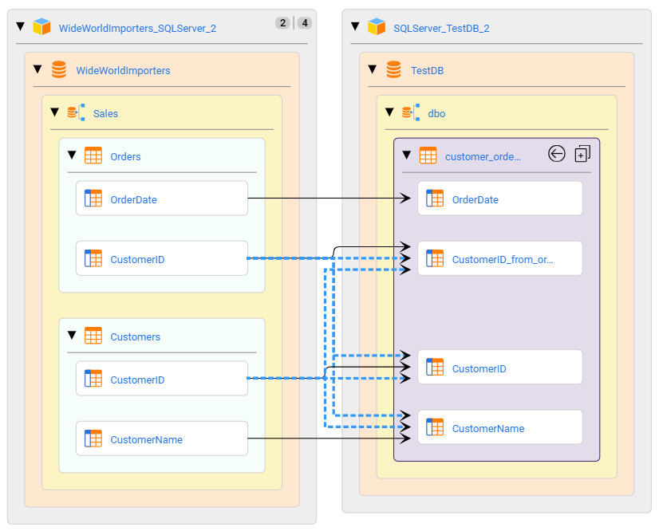

# BDM Scanner Controlflow Script

## Problem Statement

the Current BDM scanner for EDC, does not support control flow relationshios.  
This is clearly documented in the PAM.

While some scanners support control flows (treated separately to dataflows), like the PC scanner.
the BDM scanner currently does not.

For EDC users that need control flow relationships - this would require a feature request 
that would need proper analysis/planning/implementation/testing etc.

this utility script is intented to bridge the gap, to generate controlflows for Lookup 
Transformations.

## Release history

- v1.0 - 2023-09-11 initial version
- v1.1 - 2023-09-18 bugfixes, after more extensive testing
  - fixed issue with lookup fields referenced in expression with different case to tx fields.  
find for object by name is now case-insensitive
  - fixed - `RecursionError: maximum recursion depth exceeded in comparison` where circular references were found in lineage for field
  - fixed issue with lookup expression other than = is used. ` = , != , > , >= , < , <= ` are handled now 
  - added paging model for processing mappings (100 at a time)
  - added --maxhops (default=20), set max hops for field level lineage calls
- v1.2 - 2023-09-20
  - adding --mapping `mapping-name` command-line switch.  this is useful to process a single mapping for troubleshooting
    - log and csv file & lineage resource name will include mapping-name
  - adding --debug command-line switch, to enable DEBUG logging.  useful in combination with --mapping to debug controlflow for a single mapping
  - Logging updates
    - minimizing logging output (approx 6x smaller).  setting INFO logging as default, moving some log messages to DEBUG, removing un-necessary log events
    - name of log file changed to ./log/bdm_scanner_ctlflow_`{resource-name}`.log and if --mapping flag used, will be ./log/bdm_scanner_ctlflow_`{resource-name}`__`{mapping-name}`.log

## Implementation

This script is run for any BDM (Informatica Platform) resource & does the following

- For each Mapping
    - For each Lookup Transformation (in the mapping)
        - extract the lookup expression(s)
        - extract the lookup fields compared (splitting the expression into master, lookup columns)
        - get upstream lineage for the fields compared in the lookup tx.  
          - Note: upstream lineage will end for any field that is not an instance of com.infa.ldm.bdm.platform.Field
        - get downstream lineage for all lookup fields (to find where the data is mapped)
          - Note: downstream lineage ends the lineage traversal downstream when a class type other than com.infa.ldm.bdm.platform.Field is found
        - for each compared field (both master and lookup field)
            - generate a `core.DirectionalControlFlow` link to the fields found in downstream lineage
            - also generate a `core.DataSetControlFlow` for the parents of these fields (table level)
- an the end of the process, if the --edcimport flag is used
    - create or update a custom lineage resource, with same name as BDM scanner resource with _controlflow_lineage
    - upload the lineage file created by this script
    - execute the resource import


Note:  the custom lineage file imported will use direct id's - not connection assignment


## Pre-requisites

EDC v10.5.3+.  this version has support to enable lineage filtering to include control flow relationships

## Installation

download this script from TSFTP folder `/updates/Catalog_Solutions/utilities/bdm_scanner_lookup_controlflow`

file to download is named: bdm_scanner_controlflow_gen_`{version}`.zip and contains the binary executable and a PDF version of this readme

the script was created in python, and compiled to a linux binary, embedding the python runtime
so it is not necessary to install python or any 3rd party packages
(note:  source code is available on github)

unzip the package from TSFTP to any linux machine

to prepare the script to connect to EDC, the best way is to execute the packaged binary with --setup option

e.g. 
./bdm_scanner_ctrlflow_gen --setup

- you will be prompted for:-
  - EDC URL - enter the host & port - e.g. https://asvdwsndboxrh01.informatica.com:9085
  - EDC user id
  - EDC password

the script will give you the option to create a .env file.  this file is the default used to connect to EDC
other files can be generated, making it possible to easily switch between EDC services (e.g. dev & prod)
the user id used must have api access (/1 and /2 api endpoints) and must have read access to the BDM scanner objects

## Script execution

the script can be stared with 2 controlling flags:-
- -rn (or --resourceName) <BDM Scanner Resource>
- --edcimport    (flag to create/update/run the custom lineage resource)

optional switches
- --mapping `mapping-name` - runs process for a single mapping (in resource specified)
- --debug                  - switches on debug logging (could create large log files)
- -v `environment-filename`- to specify an alternate EDC environment to use (default is .env)


for other flags - pass -h - see following example

```
./bdm_scanner_ctrlflow_gen -h
BDM Scanner control flow lineage generator: version 1.2 starting
usage: bdm_scanner_ctrlflow_gen [-h] [-c EDCURL] [-v ENVFILE] [-a AUTH | -u USER] [-s SSLCERT] -rn RESOURCENAME [--mapping MAPPING] [--maxhops MAXHOPS] [-o OUTDIR] [--debug] [-i] [--setup]

optional arguments:
  -h, --help            show this help message and exit
  -c EDCURL, --edcurl EDCURL
                        edc url - including http(s)://<server>:<port>, if not already configured via INFA_EDC_URL environment var
  -v ENVFILE, --envfile ENVFILE
                        .env file with config settings INFA_EDC_URL,INFA_EDC_AUTH etc will over-ride system environment variables. if not specified - '.env' file in current folder will be used
  -a AUTH, --auth AUTH  basic authorization encoded string (preferred over -u) if not already configured via INFA_EDC_AUTH environment var
  -u USER, --user USER  user name - will also prompt for password
  -s SSLCERT, --sslcert SSLCERT
                        ssl certificate (pem format), if not already configured via INFA_EDC_SSL_PEM environment var
  -rn RESOURCENAME, --resourceName RESOURCENAME
                        setup the .env file for connecting to EDC
  --mapping MAPPING     search for a specific mapping by name (will add a fq core.name:<name entered>)
  --maxhops MAXHOPS     max lineage hops for relationships api call. 0=everything, default=20
  -o OUTDIR, --outDir OUTDIR
                        output folder to write results - default = ./out - will create folder if it does not exist
  --debug               set logging to DEBUG
  -i, --edcimport       use the rest api to create the custom lineage resource and start the import process
  --setup               setup the connection to EDC by creating a .env file - same as running setupConnection.py
```


# files created by this script
- ./out/`{resource-name}`_controlflow_lineage.csv  (the csv file with controlflow links) - folder location can be modified using -o <OUTDIR> parameter
  - if --mapping is used - csv file will be named ./out/`{resource-name}`_controlflow_lineage_`{mapping-name}`.csv
- ./log/bdm_scanner_ctlflow_`{resource-name}`.log or ./log/bdm_scanner_ctlflow_`{resource-name}`__`{mapping-name}`.log (if --mapping mapping-name is used)

# Example

Simple developer mapping with a lookup - shows a source table (Orders) and a lookup table (Customers)
where CustomerID for each is used as the lookup expression.
there are 3 columns returned from the lookup that are linked to the final target tx.



dataset level, - showing (correct) dataflow links, no controlflows - (before runing controlflow script)



element level - showing (correct) dataflow links, no controlflows  (before runing controlflow script)




after script execution and switching on control flows



after script execution, showing the 2 control fields, with control flow lineage to the 3 fields used via the lookup transformation



## Example 1 - command-line settings/output

from the example above, the following command-line was used (removed some console output details for shorter display)

```
./bdm_scanner_ctrlflow_gen -rn BDM_Scanner_pmr_4789 --edcimport
BDM Scanner control flow lineage generator: version 1.2 starting
using Python version: 3.9.2
log file: ./log/bdm_scanner_ctlflow_BDM_Scanner_pmr_4789.log
        reading common env/env file/cmd settings
ready to check .env file .env
                loading from .env file .env
                read edc url from .env value=https://asvdwsndboxrh01.informatica.com:9085
                replacing edc url with value from .env
                replacing edc auth with INFA_EDC_AUTH value from .env
        finished reading common env/.env/cmd parameters
validating connection to https://asvdwsndboxrh01.informatica.com:9085
        api status code=200
EDC version: 10.5.4.1 ## 105410
command-line args parsed = Namespace(edcurl=None, envfile='.env', auth=None, user=None, sslcert=None, resourceName='BDM_Scanner_pmr_4789', mapping=None, maxhops=20, outDir='./out', debug=False, edcimport=True, setup=False)

output folder=./out
import to EDC: True
ready to find mappings that have lookups..
search for platform mappings using query=core.classType:com.infa.ldm.bdm.platform.Mapping fq=['core.resourceName:BDM_Scanner_pmr_4789'], pagesize=100
objects found: 3 offset: 0 pagesize=100 currentPage=1 objects 1 - 100
processing mapping: 1 of 3 - BDM_Scanner_pmr_4789://BDM_Scanner_pmr_4789/Application/Application_Lookup/Mapping/Lookup
        lookup found: Lookup_COUNTRIES
        reading lookup details id=BDM_Scanner_pmr_4789://BDM_Scanner_pmr_4789/Application/Application_Lookup/Mapping/Lookup/LookUpTransformation/Lookup_COUNTRIES
        lookup condition=COUNTRY_CODE = World_City_Code
        lookup statements found = 1
        getting lookup fields (via group)
        lookup group obj has 4 fields
        4 lookup fields found
        analyzing lookup statements: 1
        fields compared = ['COUNTRY_CODE', '=', 'World_City_Code']
        lookup left: BDM_Scanner_pmr_4789://BDM_Scanner_pmr_4789/Application/Application_Lookup/Mapping/Lookup/LookUpTransformation/Lookup_COUNTRIES/Group/Group/Field/COUNTRY_CODE
        lookup rght: BDM_Scanner_pmr_4789://BDM_Scanner_pmr_4789/Application/Application_Lookup/Mapping/Lookup/LookUpTransformation/Lookup_COUNTRIES/Group/Group/Field/World_City_Code
        lineage endpoints found.... 1/2/2
         left field - upstream  :: ['BDM_Scanner_pmr_4789$$BDMScanner$$DIDQ_STOCK1://~proxy~/COUNTRIES/COUNTRY_CODE']
        right field - upstream  :: ['BDM_Scanner_pmr_4789$$BDMScanner$$DIDQ_STOCK1://~proxy~/PERSON_MASTER/NAT_CODE']
        all downstream lineage size=1
        downstream fields to link:: ['BDM_Scanner_pmr_4789$$BDMScanner$$DIDQ_STOCK1://~proxy~/FACT_PERSON/COUNTRY_CODE']
        control flow/lineage links created: 4
processing mapping: 2 of 3 - BDM_Scanner_pmr_4789://BDM_Scanner_pmr_4789/Application/app_lookup_test/Mapping/m_order_with_customer_2_srcid_not_mapped
        ... (removed for compact output in this readme)
processing mapping: 3 of 3 - BDM_Scanner_pmr_4789://BDM_Scanner_pmr_4789/Application/app_lookup_test/Mapping/m_order_with_customer
        lookup found: Lookup_Customers_for_lookup
        reading lookup details id=BDM_Scanner_pmr_4789://BDM_Scanner_pmr_4789/Application/app_lookup_test/Mapping/m_order_with_customer/LookUpTransformation/Lookup_Customers_for_lookup
        lookup condition=CustomerID = CustomerID_from_order
        lookup statements found = 1
        getting lookup fields (via group)
        lookup group obj has 31 fields
        31 lookup fields found
        analyzing lookup statements: 1
        fields compared = ['CustomerID', '=', 'CustomerID_from_order']
        lookup left: BDM_Scanner_pmr_4789://BDM_Scanner_pmr_4789/Application/app_lookup_test/Mapping/m_order_with_customer/LookUpTransformation/Lookup_Customers_for_lookup/Group/Group/Field/CustomerID
        lookup rght: BDM_Scanner_pmr_4789://BDM_Scanner_pmr_4789/Application/app_lookup_test/Mapping/m_order_with_customer/LookUpTransformation/Lookup_Customers_for_lookup/Group/Group/Field/CustomerID_from_order
        lineage endpoints found.... 1/2/6
         left field - upstream  :: ['WideWorldImporters_SQLServer://WideWorldImporters/Sales/Customers/CustomerID']
        right field - upstream  :: ['WideWorldImporters_SQLServer://WideWorldImporters/Sales/Orders/CustomerID']
        all downstream lineage size=3
        downstream fields to link:: ['SQLServer_TestDB://TestDB/dbo/customer_order_dates/CustomerID', 'SQLServer_TestDB://TestDB/dbo/customer_order_dates/CustomerID_from_order', 'SQLServer_TestDB://TestDB/dbo/customer_order_dates/CustomerName']
        control flow/lineage links created: 6
        page processed - 2.692979335784912 seconds ---
Mapping processing complete
lineage file written: ./out/BDM_Scanner_pmr_4789_controlflow_lineage.csv
Mappings processed: 3
Lookups processed: 3
Errors Found: 0
element lineage links written: 16
dataset lineage links written: 4
max reursion from lineage: 2
run time = 2.8083503246307373 seconds ---
ready to create/update lineage resource... BDM_Scanner_pmr_4789_controlflow_lineage from ./out/BDM_Scanner_pmr_4789_controlflow_lineage.csv BDM_Scanner_pmr_4789_controlflow_lineage.csv
getting resource for catalog:-https://asvdwsndboxrh01.informatica.com:9085 resource=BDM_Scanner_pmr_4789_controlflow_lineage
        response=200
        resource is valid: BDM_Scanner_pmr_4789_controlflow_lineage
        checking for file name change...
             file=['BDM_Scanner_pmr_4789_controlflow_lineage.csv']
        checkiung:BDM_Scanner_pmr_4789_controlflow_lineage.csv
                file name is same...
        no changes to resource def...
uploading file ./out/BDM_Scanner_pmr_4789_controlflow_lineage.csv to resource: BDM_Scanner_pmr_4789_controlflow_lineage
uploading file for resource https://asvdwsndboxrh01.informatica.com:9085 resource=BDM_Scanner_pmr_4789_controlflow_lineage
        url=https://asvdwsndboxrh01.informatica.com:9085/access/1/catalog/resources/BDM_Scanner_pmr_4789_controlflow_lineage/files
        {'scannerid': 'LineageScanner', 'filename': 'BDM_Scanner_pmr_4789_controlflow_lineage.csv', 'optionid': 'File'}
        {'file': ('BDM_Scanner_pmr_4789_controlflow_lineage.csv', <_io.TextIOWrapper name='./out/BDM_Scanner_pmr_4789_controlflow_lineage.csv' mode='rt' encoding='UTF-8'>, 'text/csv')}
        response=200
starting resource load: BDM_Scanner_pmr_4789_controlflow_lineage
starting scan resource https://asvdwsndboxrh01.informatica.com:9085 resource=BDM_Scanner_pmr_4789_controlflow_lineage
        url=https://asvdwsndboxrh01.informatica.com:9085/access/2/catalog/resources/jobs/loads
        {'accept': 'application/json', 'Content-Type': 'application/json'}
        {'resourceName': 'BDM_Scanner_pmr_4789_controlflow_lineage'}
        response=200
        Job Queued: 13f600ea-0c9f-4026-b3da-fb548448899c
        Job def: {'resourceName': 'BDM_Scanner_pmr_4789_controlflow_lineage', 'jobId': '13f600ea-0c9f-4026-b3da-fb548448899c', 'status': 'QUEUED', 'jobType': 'SCAN_JOB', 'startTime': 0, 'endTime': 0, 'jobHref': '/2/catalog/resources/jobs/loads/13f600ea-0c9f-4026-b3da-fb548448899c'}
process complete
```

## Example 2 - run process with a single mapping, and debug mode enabled

```
./bdm_scanner_ctrlflow_gen -rn BDM_Scanner_pmr_4789  --mapping m_order_with_customer --debug
BDM Scanner control flow lineage generator: version 1.2 starting
        storing mapping=m_order_with_customer to filter search
debug logging enabled
log file: ./log/bdm_scanner_ctlflow_BDM_Scanner_pmr_4789__m_order_with_customer.log
        reading common env/env file/cmd settings
ready to check .env file .env
                loading from .env file .env
                read edc url from .env value=https://asvdwsndboxrh01.informatica.com:9085
                replacing edc url with value from .env
                replacing edc auth with INFA_EDC_AUTH value from .env
        finished reading common env/.env/cmd parameters
validating connection to https://asvdwsndboxrh01.informatica.com:9085
        api status code=200
EDC version: 10.5.4.1 ## 105410
command-line args parsed = Namespace(edcurl=None, envfile='.env', auth=None, user=None, sslcert=None, resourceName='BDM_Scanner_pmr_4789', mapping='m_order_with_customer', maxhops=20, outDir='./out', debug=True, edcimport=False, setup=False)

output folder=./out
import to EDC: False
ready to find mappings that have lookups..
search for platform mappings using query=core.classType:com.infa.ldm.bdm.platform.Mapping fq=['core.resourceName:BDM_Scanner_pmr_4789', 'core.name:m_order_with_customer'], pagesize=100
objects found: 1 offset: 0 pagesize=100 currentPage=1 objects 1 - 100
processing mapping: 1 of 1 - BDM_Scanner_pmr_4789://BDM_Scanner_pmr_4789/Application/app_lookup_test/Mapping/m_order_with_customer
        lookup found: Lookup_Customers_for_lookup
        reading lookup details id=BDM_Scanner_pmr_4789://BDM_Scanner_pmr_4789/Application/app_lookup_test/Mapping/m_order_with_customer/LookUpTransformation/Lookup_Customers_for_lookup
        lookup condition=CustomerID = CustomerID_from_order
        lookup statements found = 1
        getting lookup fields (via group)
        lookup group obj has 31 fields
        31 lookup fields found
        analyzing lookup statements: 1
        fields compared = ['CustomerID', '=', 'CustomerID_from_order']
        lookup left: BDM_Scanner_pmr_4789://BDM_Scanner_pmr_4789/Application/app_lookup_test/Mapping/m_order_with_customer/LookUpTransformation/Lookup_Customers_for_lookup/Group/Group/Field/CustomerID
        lookup rght: BDM_Scanner_pmr_4789://BDM_Scanner_pmr_4789/Application/app_lookup_test/Mapping/m_order_with_customer/LookUpTransformation/Lookup_Customers_for_lookup/Group/Group/Field/CustomerID_from_order
        lineage endpoints found.... 1/2/6
         left field - upstream  :: ['WideWorldImporters_SQLServer://WideWorldImporters/Sales/Customers/CustomerID']
        right field - upstream  :: ['WideWorldImporters_SQLServer://WideWorldImporters/Sales/Orders/CustomerID']
        all downstream lineage size=3
        downstream fields to link:: ['SQLServer_TestDB://TestDB/dbo/customer_order_dates/CustomerID', 'SQLServer_TestDB://TestDB/dbo/customer_order_dates/CustomerID_from_order', 'SQLServer_TestDB://TestDB/dbo/customer_order_dates/CustomerName']
        control flow/lineage links created: 8
        page processed - 0.9354209899902344 seconds ---
Mapping processing complete
lineage file written: ./out/BDM_Scanner_pmr_4789_controlflow_lineage.csv
Mappings processed: 1
Lookups processed: 1
Errors Found: 0
element lineage links written: 6
dataset lineage links written: 2
max reursion from lineage: 2
run time = 1.044832468032837 seconds ---

custom lineage resource will not be created/updated/executed. use -i|--edcimport flag to enable
```
