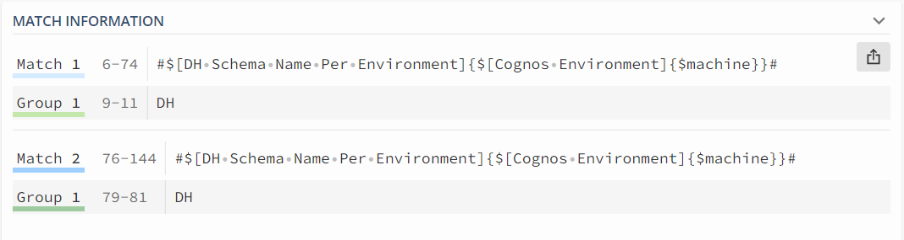

# EDC XDOC Lineage Generator

the xdoc_lineage_gen script was designed to enable generation of lineage for EDC where external connection-assignment may not be working as expected.

a current case where this is useful, is when Cognos is scanned, and Cognos is configured to use paramerized schema names.

when these parameters are used (before EDC v10.5.3) the scanner used the parameter definiton as the schema name to resolve and not the actual schema name.

for situations like this - the xdoc lineage gen process can be configured to find occurrences of lineage links using a regular expression, and replace those links with a string, or subset of the found regex.

the process only looks for source/target references that have use connections - it isolates these by looking at the format of all fromObjectIdentity and toObjectIdentity references for a connection.  the format of a connection is ${connection_name}/connection_path

## Example of usage

example of usage.  

If the upstream lineage link for an object is formatted like this:-

```
${EDW.#$[DH Schema Name Per Environment]{$[Cognos Environment]{$machine}}#}/#$[DH Schema Name Per Environment]{$[Cognos Environment]{$machine}}#/ETL_ODS_CYCLE_STATUS
```

this is an example of a paramerized connection.

we actually want to replace all values between the #$  and # characters with the actual schema name

so the end result should be:-

```
${EDW.DH}/DH/ETL_ODS_CYCLE_STATUS
```

to do this - we use a regular expression to find/parse the values we need

the regex for this case is:-

```
\#\$\[(\S+)[^\/]*\#
```

if you use this example using a regex test site - like regex101.com - you can see the result. see it live here https://regex101.com/r/VDb60K/1


and the match information display shows 2 matches



it shows Group 1 in both cases is "DH" which is the value we want to replace

to replace using a regex group - we use this syntax

```
"\g<1>"
```

this is as standard python expression for a replace string - the \g<1> reference means replace using group1 from the regex.  other strings could be used (any literal string - e.g. abc\g>1 would replace abcDH into the result)

Note:
this regex could also work in exactly the same way for the example above, and might be easier to understand
```
\#\$\[(\S+)[^\#]*\#
```

regex101 also provides an easy to understand explanation of the regex pattern used


## substituion CSV file

a csv file is used to pass any number of substituition expressions making the process model driver (no hard-coding of any search/replace syntax)

the format of the csv file has 2 columns:-

- from_regex  - the regex to find instances to replace
- replace_expr - the expression used to replace values

for the example above the csv file would be formatted like this:-

```
from_regex,replace_expr
"\#\$\[(\S+)[^\/]*\#","\g<1>"
```

viewing this in a tabular mode might be easier

|from_regex|replace_expr                 |
|----------|-----------------------------|
|\#\$\[(\S+)[^\/]*\#|\g<1>                        |


the process will store and try and execute every regex search/replace set of expressions

the actual code used to replace the value uses python's re (regex) re.sub function
```python
re.sub(pattern, repl, string, count=0, flags=0)
```

see python documentation for more https://docs.python.org/3/library/re.html#re.sub

for the replacement syntax, this extract from the python docs should be useful

> In string-type repl arguments, in addition to the character escapes and backreferences described above, \g<name> will use the substring matched by the group named name, as defined by the (?P<name>...) syntax. \g<number> uses the corresponding group number; \g<2> is therefore equivalent to \2, but isn’t ambiguous in a replacement such as \g<2>0. \20 would be interpreted as a reference to group 20, not a reference to group 2 followed by the literal character '0'. The backreference \g<0> substitutes in the entire substring matched by the RE.
---

## Command-Line Syntax

```
usage: xdoc_lineage_gen.py [-h] [-c EDCURL] [-v ENVFILE] [-a AUTH | -u USER] [-s SSLCERT] -rn RESOURCENAME
                           [-rt RESOURCETYPE] [-o OUTDIR] [-f] [--modifiedonly] [-sf SUBST_FILE] [-i]        
                           [--setup]

optional arguments:
  -h, --help            show this help message and exit
  -c EDCURL, --edcurl EDCURL
                        edc url - including http(s)://<server>:<port>, if not already configured via
                        INFA_EDC_URL environment var
  -v ENVFILE, --envfile ENVFILE
                        .env file with config settings INFA_EDC_URL,INFA_EDC_AUTH etc will over-ride system  
                        environment variables. if not specified - '.env' file in current folder will be      
                        used
  -a AUTH, --auth AUTH  basic authorization encoded string (preferred over -u) if not already configured     
                        via INFA_EDC_AUTH environment var
  -u USER, --user USER  user name - will also prompt for password
  -s SSLCERT, --sslcert SSLCERT
                        ssl certificate (pem format), if not already configured via INFA_EDC_SSL_PEM
                        environment var
  -rn RESOURCENAME, --resourceName RESOURCENAME
                        resource name for xdoc download
  -rt RESOURCETYPE, --resourceType RESOURCETYPE
                        resource type (provider id) for xdoc download
  -o OUTDIR, --outDir OUTDIR
                        output folder to write results - default = ./out - will create folder if it does     
                        not exist
  -f, --force           force overwrite of xdoc json file (if already existing), otherwise just use the      
                        .json file
  --modifiedonly        export only modified lineage links (not all external links)
  -sf SUBST_FILE, --subst_file SUBST_FILE
                        regex substitition file (header: from_regex,replace_expr)
  -i, --edcimport       use the rest api to create the custom lineage resource and start the import process  
  --setup               setup the connection to EDC by creating a .env file - same as running
                        setupConnection.py
```

## Installation/Setup

Follow notes outlined here: [README.md](../README.md)
pre-requisite is python 3.6 or higher. 

to summarize, a good approach would be (for linux/macos):

- create a virtual environment  (one time process)
  - `python3 -m venv .venv`
- activate the virtual environment (each time you need to)
  - `source .venv/bin/activate`
- download dependent packages (requires internet access, 1 time process)
  - `python -m pip install -r requirements.txt`
  - this will install the following packages:
    - requests  - common libraries for http processing
    - python-dotenv - command-line handling
    - openpyxl - some utilities read/write excel  (not used for xdoc_lineage_gen)
- configure connection to EDC (stores as a .env file, or other as needed, one time for each EDC instance)
  - python xdoc_lineage_gen.py --setup
    - prompts user for edc url (https://server:port), user and password
- run the xdoc_lineage_gen process
  - python xdoc_lineage_gen -rn `<resource_to_process>`

